# BedlamCore

**Bed Wars that feels finished — GUI-first setup, one jar from Spigot 1.8.8 to Paper 26.2.**

Independent project by [IYanel-DEV](https://github.com/IYanel-DEV). Not affiliated with Hypixel, Mojang, or Microsoft. Ships no third-party server code, maps, or branding.

Current line: **0.10.41** · [Releases](https://github.com/IYanel-DEV/BedlamCore/releases) · [Repository](https://github.com/IYanel-DEV/BedlamCore)

---

## Showcase

<p align="center">
  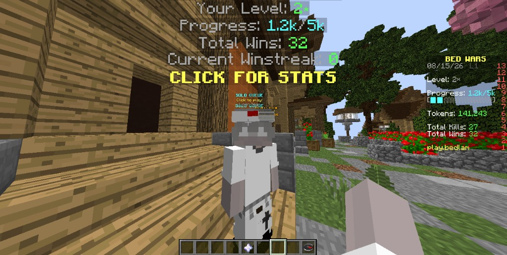
  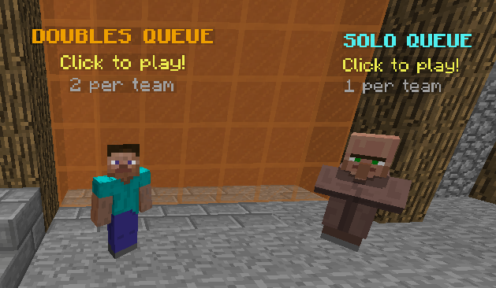
</p>

<p align="center">
  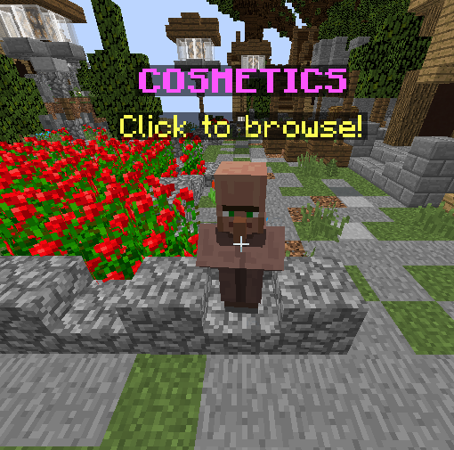
  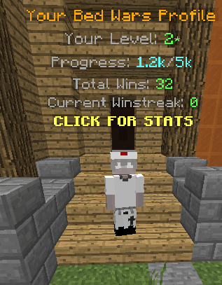
</p>

<p align="center">
  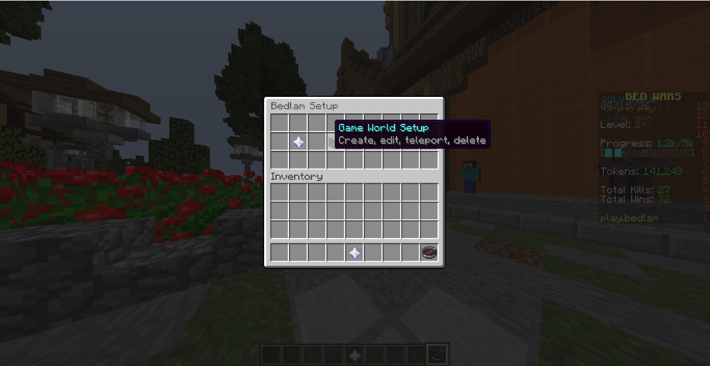
  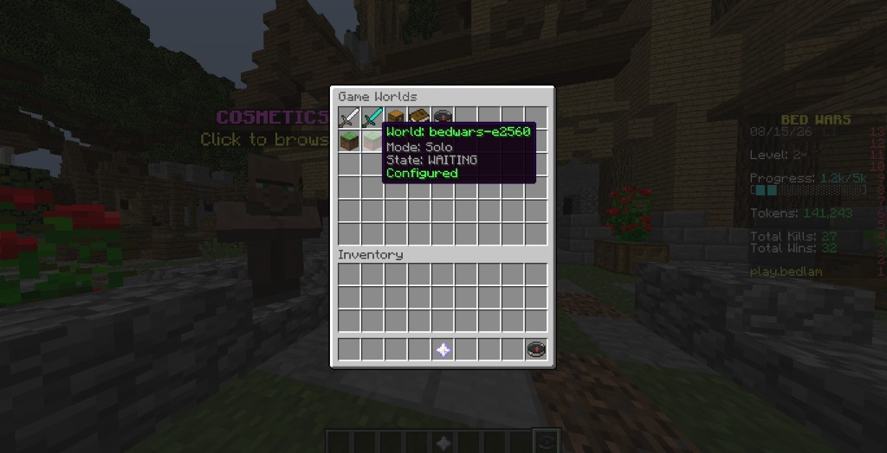
</p>

<p align="center">
  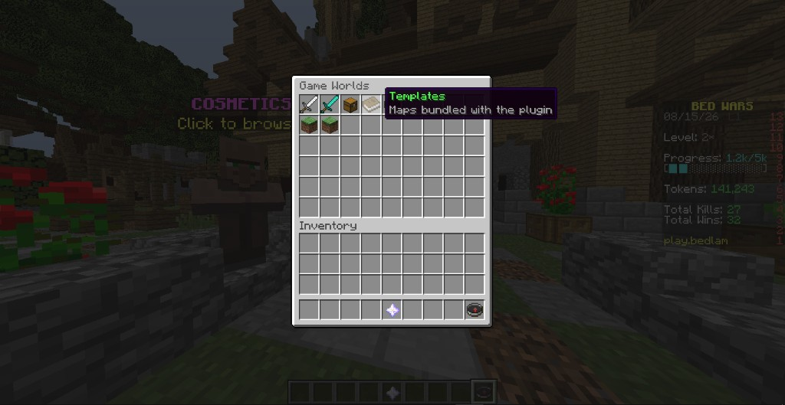
  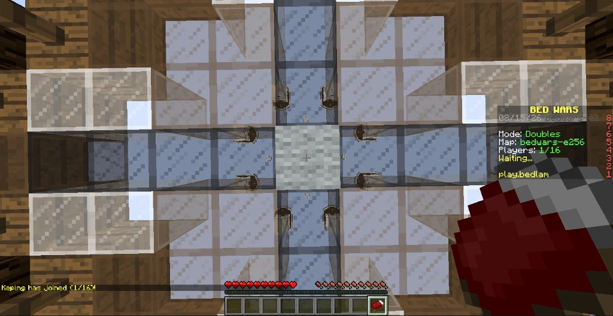
</p>

<p align="center">
  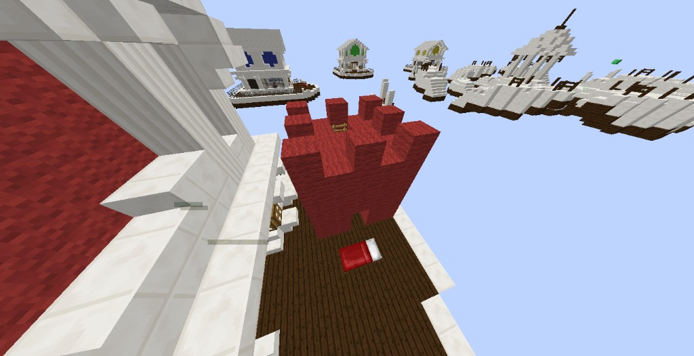
  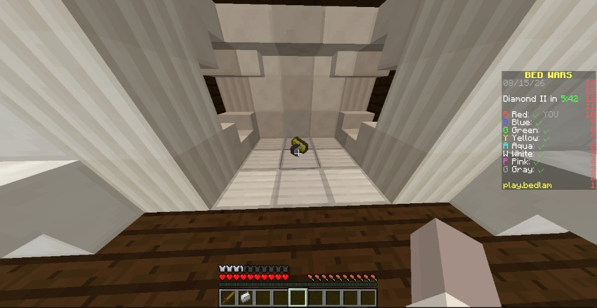
</p>

<p align="center">
  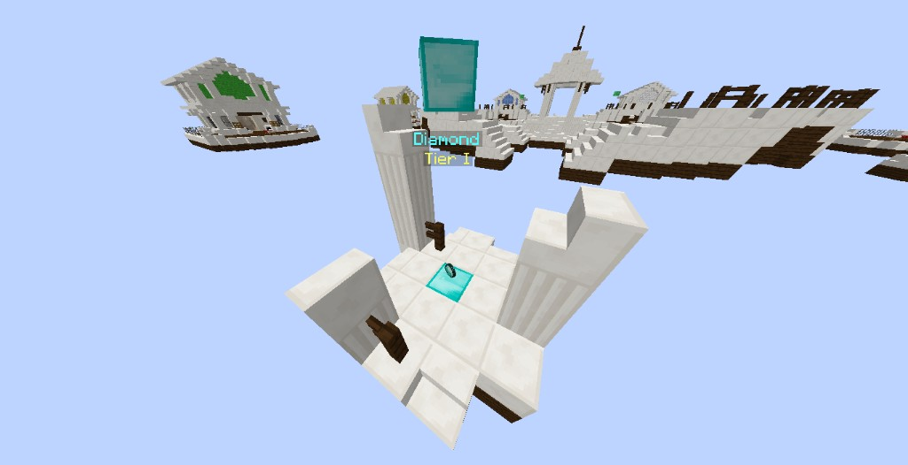
  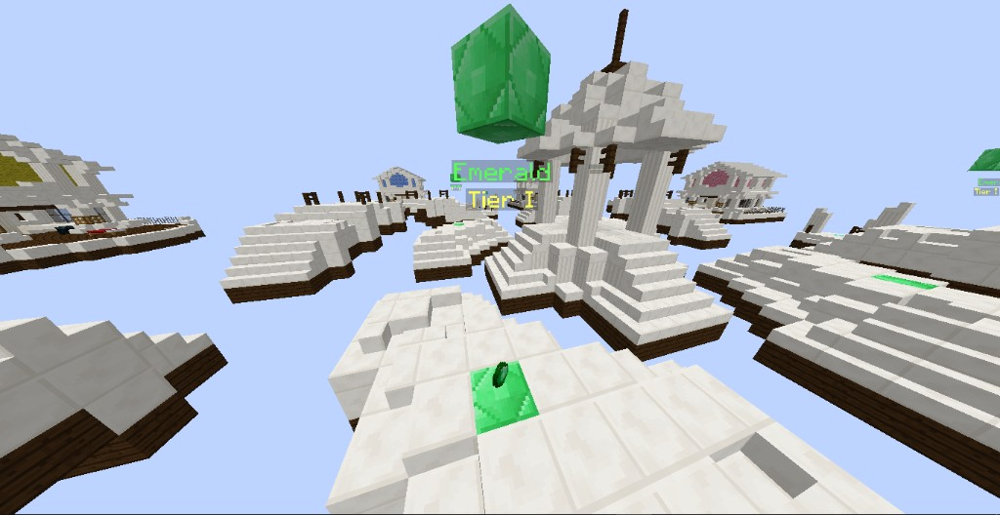
</p>

<p align="center">
  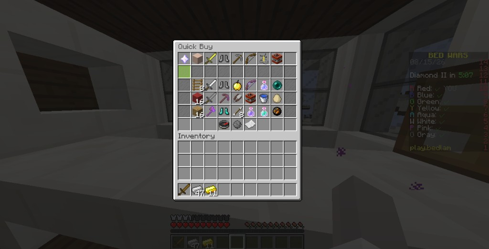
  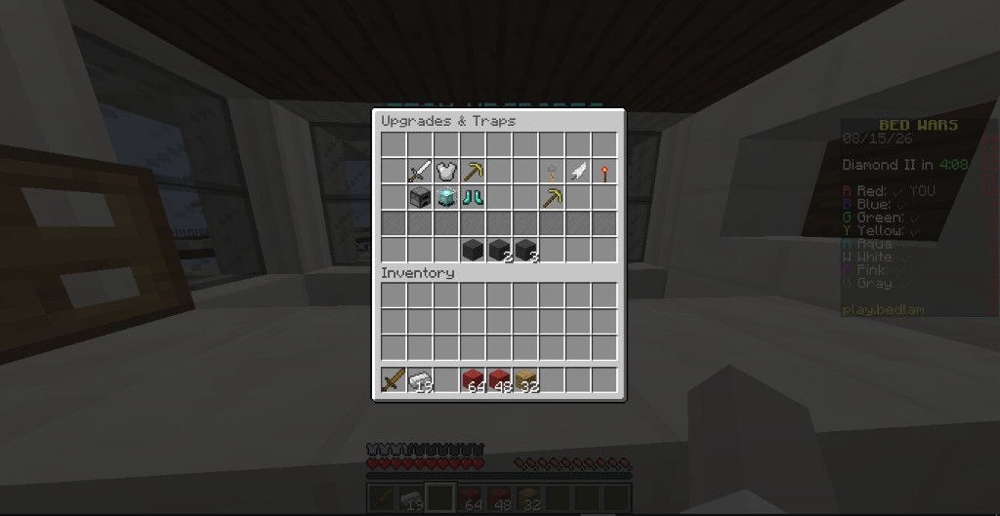
</p>

<p align="center">
  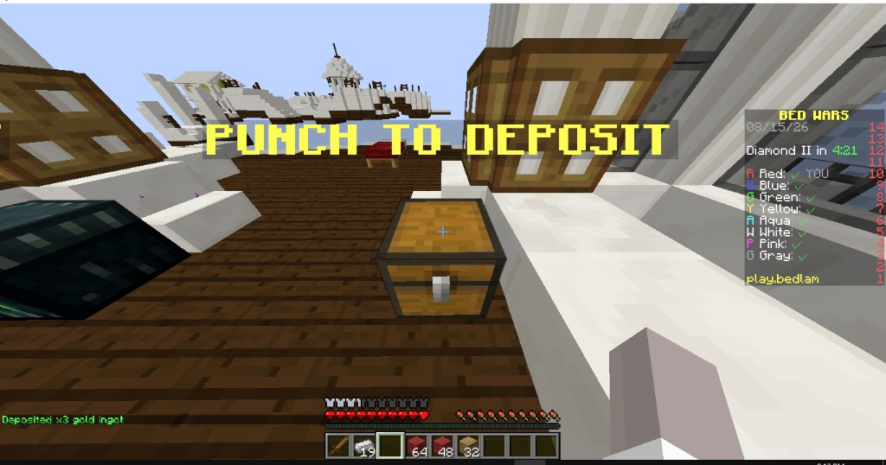
  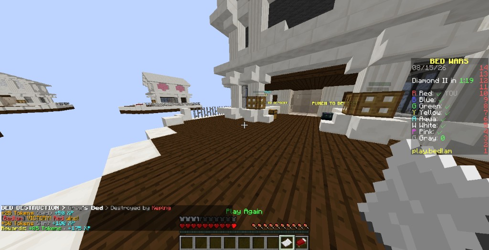
</p>

More stills in [`docs/showcase/`](docs/showcase/): cosmetics shop, stats GUI, play menu, shop NPCs.

---

## Features

| Area | What you get |
|------|----------------|
| **Lobby** | Solo / Doubles queue NPCs (Citizens or built-in fallback), profile NPC + statistics GUI, cosmetics NPC (token shop), lobby scoreboard (level / tokens / kills / wins) |
| **Setup** | Compass-driven Lobby Setup and Game World Setup — drafts, Apply / Cancel, no command maze |
| **Arenas** | Multi-world Solo & Doubles; waiting structure (`/bc spawnbuild`); spectator spawn; teams, beds, forges, shops, chests, gens |
| **Templates** | Bundled map template **bedwars-e2560**; Import Maps flow for folder worlds |
| **Border** | Build radius from waiting + spectator center (setup-visible); match builds stay inside |
| **Match** | Quick Buy shop, upgrades & traps, forge share, diamond/emerald tiers, bridge egg, Dream Defender, soft spectate (adventure + flight + invis — not `SPECTATOR`) |
| **Economy** | Tokens / XP / levels in `stats.yml`; match rewards; punch-to-deposit team chests |
| **Reset** | Pristine world snapshots between matches; crash-safe YAML / world replace |

---

## Requirements

- **Java 8+** runtime on the server (bytecode is Java 8; build with a modern JDK + Gradle toolchain)
- **Spigot / Paper 1.8.8 → 26.2** (one jar)
- Optional: **Citizens** for real fake-player queue NPCs (armor-stand / mob fallback otherwise)

---

## Install

1. Download `BedlamCore-*.jar` from [Releases](https://github.com/IYanel-DEV/BedlamCore/releases), or build (below).
2. Drop the jar into `plugins/` and restart.
3. Join as an operator — hotbar **Bedlam Setup** compass opens Lobby Setup in the lobby, or that world's arena draft in a game world.
4. Complete Lobby Setup (spawn + NPCs), then create or import game worlds. **Apply** saves; **Cancel** discards.
5. Players join via queue NPCs (or `/bedlam` fallbacks). Ops can `/bedlam forcestart` in a waiting arena for solo testing.

```powershell
.\gradlew.bat clean check build
```

```bash
./gradlew clean check build
```

Jar: `build/libs/BedlamCore-<version>.jar` (version from `build.gradle.kts` only).

Local multi-version harness: `servers/setup.ps1` spins up one Paper test server per commonly-used version. Set up all of them, or one with `-Version 1.16.5`. See [`servers/README.md`](servers/README.md). Release checklist: [`docs/RELEASING.md`](docs/RELEASING.md).

| Server | Version | Port | Java |
|--------|---------|------|------|
| `legacy-1.8.8`  | 1.8.8  | 25565 | 8 |
| `stable-1.12.2` | 1.12.2 | 25567 | 8 |
| `stable-1.16.5` | 1.16.5 | 25568 | 11+ |
| `stable-1.20.4` | 1.20.4 | 25569 | 17+ |
| `latest-26.2`   | 26.2   | 25570 | 25+ |

---

## Tutorials

### Lobby Setup

1. Op in the lobby world → open the **compass**.
2. **Lobby Setup** → set network spawn.
3. Place **Solo** and **Doubles** queue NPCs (placer item → place; shift-click edits mob/skin/look-at).
4. Optional: **Profile NPC**, **Cosmetics** NPC.
5. **Apply**. Players see queue holograms, profile stats, and the lobby sidebar (`play.bedlam` footer is configurable).

### Game Setup / Templates / Import

1. Compass → **Game World Setup** → create a Solo or Doubles void world, or open **Templates** / **Import Map**.
2. Teleport into the arena (setup opens automatically). Set waiting spawn, spectator, teams, beds, forges, item/upgrade shops, team + ender chests, diamond/emerald gens.
3. `/bc spawnbuild` — two-click golden axe for the waiting cuboid (glass is not a valid corner; one diamond block = relative spawn anchor).
4. Set **build border** radius once waiting + spectator exist (default 64 from their midpoint; outline only in setup).
5. **Apply** — waiting paste stripped, world saved, pristine snapshot taken, back to lobby.

Bundled template **bedwars-e2560** is a 1.8-era anvil world that works through Paper 26.2 (Paper converts on first load; BedlamCore strips `session.lock` / `entities` / `poi` and clears a conflicting `world/dimensions/minecraft/<name>` leftover before createWorld).

### Match flow

Queue NPC → waiting structure + countdown → team spawn → forge / shop / upgrades → beds → soft spectate on final death → victory rewards → Play Again / lobby return. Inventory is cleared on leave; ender chests do not persist across matches.

---

## Commands

| Command | What it does |
|---------|----------------|
| `/bedlam` (`/bc`) | Fallback hub: `menu`, `solo`, `doubles`, `leave`, `spawnbuild`, `forcestart`, `reload` |
| `/leave` | Leave match / return to lobby |

Primary UX is the setup compass and lobby NPCs — commands are fallbacks and admin tools.

## Permissions

| Permission | Default | Purpose |
|------------|---------|---------|
| `bedlam.admin` | op | Configure arenas, force-start, setup |
| `bedlam.play` | true | Join games |
| `bedlam.lobby.build` | false | Break/place in the lobby world |

---

## Config

Start with `plugins/BedlamCore/config.yml` after first boot:

- Lobby teleport-on-join, isolation (chat / tab), team chat prefixes
- Mode minimums, countdown / respawn / ending timers, void depth
- Scoreboard footer (`play.bedlam`) and lobby id
- Cosmetics catalog (kill-message packs, costs) — owned gear lives in `stats.yml`
- Optional Hypixel Quick Buy import: prefer env `BEDLAM_HYPIXEL_API_KEY`; `hypixel-api-key` in config is a fallback — never commit a real key

Arena layout lives in `arenas.yml`. Player progression: `stats.yml`.

---

## License

**Proprietary — All Rights Reserved.** See [`LICENSE`](LICENSE).

You may download, install, and run the **unmodified** official plugin on your servers without asking. Public mirrors of the unmodified official jar are allowed with attribution and a link to [IYanel-DEV/BedlamCore](https://github.com/IYanel-DEV/BedlamCore). **Modification**, derivative works, redistributing modified builds, and rebranding require **prior written permission** from the copyright holder ([IYanel-DEV](https://github.com/IYanel-DEV)).

---

## Links

- GitHub: [IYanel-DEV/BedlamCore](https://github.com/IYanel-DEV/BedlamCore)
- Releases: [github.com/IYanel-DEV/BedlamCore/releases](https://github.com/IYanel-DEV/BedlamCore/releases)
- Author: [IYanel-DEV](https://github.com/IYanel-DEV)


